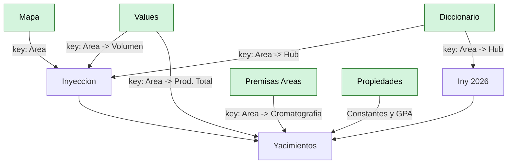
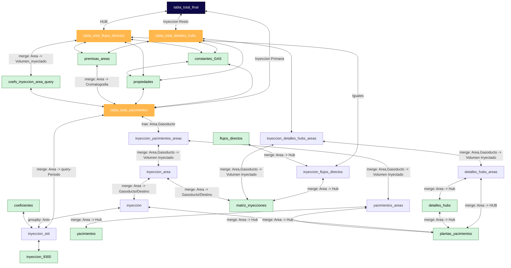
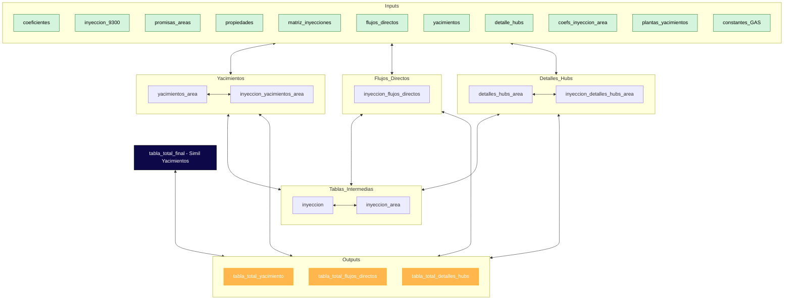
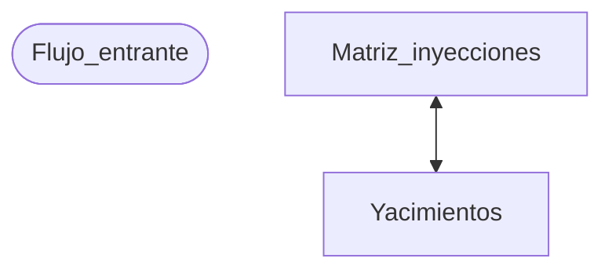

# Migración Modelo Acondicionamiento de gas CN-VM


## Esquema Excel





## Esquema Python





## Esquema Python simplificado




## Inputs 
| Sheet Excel original | Descripción | Reemplazado por |
|---|---|---|
| `Values` | Separe los valores de iny a 9300 y los coefs para std | `coeficientes, inyeccion_9300` |
| `Mapa` | Misma tabla | `mapa` |
| `Premisas area` | Mismos valores | `premisas_areas` |
| `Propiedades` | Separe los valores de ctes de gas y solo me quede con los no calculados | `propiedades, constantes_GAS` |
| `Diccionario` | Separe la matriz de origen-destino de plantas y gasoductos y el listado de HUB's | `matriz_inys, plantas_yacimientos` |
| `Inyeccion 2026` | Separe por tipo de inyeccion y aparte el detalle de hubs | `yacimientos, detalles_hubs, flujos_directos` |
| `Coeficientes inyeccion area` | Coefs de inyeccion area para la dinamica | `coefs_iny_area` |


## Estructura del proyecto


```
proyecto/
├── config.py                  # paths, capacidad, periodo_considerado, fecha_random
├── io_/
│   └── loaders.py             # funciones (no module-level!) para leer cada sheet,
│                               # con path configurable. Ej: load_constantes_gas(path)
├── domain/
│   ├── normalizacion.py       # normalizar, asignar_estacion
│   ├── propiedades_gas.py     # calcular_propiedades_gas
│   └── retenidos.py           # calcular_retenidos, calcular_energia_total, correcciones
├── pipeline/
│   ├── preprocesamiento.py    # fillna + normalizar sobre inputs crudos
│   ├── inyeccion.py           # inyeccion_std, inyeccion, inyeccion_area
│   ├── yacimientos.py         # yacimientos_areas, inyeccion_yacimientos_areas
│   ├── detalles_hubs.py
│   ├── flujos_directos.py
│   ├── tabla_total.py         # tabla_total_yacimientos + tabla_total_flujos_directos
│   │                           # (comparten ~90% de lógica, se puede parametrizar)
│   └── modelado_plantas.py    # tabla_mega, tabla_tty_dp, retenidos, correcciones
├── outputs/
│   └── writers.py             # to_csv centralizado, opcional (flag para activar/desactivar)
└── main.py                    # orquesta: carga → preprocesa → pipeline → outputs
```


```
calidad-gas/
├── datos/
│   ├── inputs.xlsx     # excels de input originales
│   └── processed/      # outputs intermedios
├── src/
│   ├── io.py                # lectura de inputs
│   ├── modelo.py            # lógica de cálculo
│   └── validaciones.py      
├── docs/
│   ├── data_dictionary.md    # info de normalizacion de inputs y tipo de datos
│   └── changelog.md          # decisiones e historial de cambios
|
├── capa_frontend_streamlit/
|
└── README.md
```


## Flujo
- Normalizo iny 9300 a std dividiendo con los coefs
- Creo 
  - yacimientos_areas: Merge de yacimientos(inyeccion primaria) con plantas_yacimientos(HUB's)
- Trabajo sobre la serie temporal en inyeccion std para sacar el promedio por año(Aca no se que tan importante es la estacion?)
- Creo
  - inyeccion: inyeccion_std grupeada por valor medio segun año
- Mergeo inyeccion con plantas_yacimientos para agragar HUBS
- Creo
  - inyeccion_area: Merge de inyeccion con matriz_inyecciones para añadir el destino/gasoductos
- Creo
  - inyeccion_yacimientos_area: Merge inyeccion_area con yacimientos_area para agregar el volumen inyectado a cada destino
- Los ultimos dos pasos los repito con detalles_hubs y flujos_directos
- Selecciono un periodo particular y comienzo con las tablas_total que serian las YAC's 


## Consultas
- Hojas HUB's. ¿Como es la logica y sobre produccion total? Cromas gasoductos [Flujos de áreas directo a gasoductos, Flujos totales gasoductos]
- Hoja propiedades.
- ¿Como tratamos la matriz de inyeccion?
- Consultar sobre el modelado de las plantas. ¿Donde entran los datos de yacimientos? 
- Hay algunas inconsistencias en yacimientos inyeccion primaria. Del script de validacion saltan en cromas
- Veo que la inyeccion secundaria en yacimientos es con query entonces no me termina de cerrar donde entra la matriz de inyeccion
- Los datos de cromato usados para TTY DP no son vmn y vms eso hay que cambiarlo. yo agarre lo de las areas que son las que conectan a TTY DP y use eso pero no es la idea
- Sobre las cromatos por ejemplo en aquellas que dicen nombre, nombre TBX. Entiendo que una es pre y otra post la consulta apunta a cual utilizo para por ejemplo cuando modelo la planta TTY (DP)


## TODO
- Agregar reestriccion a la capacidad de gasoductos y logica de evacuacion del gas





Me entra el dato de flujo total segun area que lo saco de yacimientos. Las areas salen de matriz_iny. De props me saco los datos del gas y dsp me tengo que traer la data del area de cromato osea aca composicion molar pero es del area en si.