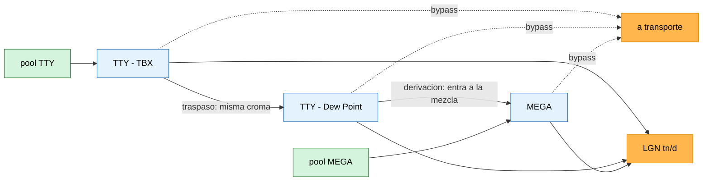
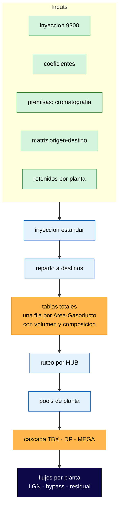

# Modelo de acondicionamiento de gas CN-VM

**Migración a Python del modelo Excel de balance de gas y producción de LGN**
de la cascada de plantas de tratamiento de las cuencas Neuquina y Vaca Muerta.

Dado un mes, el modelo responde: cuánto gas trata cada planta, cuánto LGN
produce, cuánto le pasa a la siguiente y cuánto queda sin tratar. Encima del
pipeline hay un tablero para correr escenarios, ver la evolución mes a mes y
preguntarle al sistema qué está pasando.

```bash
pip install -r requirements.txt
streamlit run app.py
```

---

## Qué problema resuelve

El modelo vivía en un Excel de 16 hojas con BUSCARV encadenados, tablas
dinámicas y una cascada de fórmulas `MIN` y restas. Funcionaba, pero:

| En el Excel | En el pipeline |
|---|---|
| un BUSCARV fallido daba `#N/A` a la vista | se reporta por consola y se ve junto en el panel de diagnósticos |
| probar un escenario era duplicar la hoja | se arma en el sandbox y se compara contra el oficial |
| un mes = abrir el libro y recalcular a mano | un período, o una serie de 60, a un botón |
| la lógica estaba en las celdas | está en módulos, con tests e invariantes |
| nadie sabía por qué una fórmula era así | hay un registro de decisiones |

La traducción operación por operación —qué es un `merge`, un `melt`, un
`groupby` en términos de Excel— está en el **[documento
informativo](docs/flujo_pipeline_gas.html)**, que es el mejor punto de entrada
si venís del modelo viejo.

---

## La cascada

Lo que hay que entender antes que nada: **TTY-TBX y TTY-Dew Point no son dos
plantas en paralelo, son dos trenes sobre el mismo pool de gas.** Comparten la
cromatografía; lo único que se reparte es el volumen. MEGA tiene pool propio, de
otra composición.



Y la regla que ordena todo: **una planta se llena cuando agota su capacidad de
evacuación de LGN (tn/d), no su capacidad de ingreso de gas.** El ingreso rara
vez limita; entra como un mínimo adicional.

Antes de la fecha de parada de mantenimiento, TBX está fuera de servicio y el
pool TTY entero cae en Dew Point.

---

## El pipeline



Dos pasos que no son obvios y explican la mayoría de las sorpresas:

**El ruteo por HUB.** Un área con hub asignado no inyecta directo a la planta:
su gas entra al hub, que lo mezcla y lo reparte. Por eso la inyección de un área
puede figurar contra un hub y no contra la planta — no es gas perdido.

**Los retenidos son lineales.** A composición y coeficientes fijos, el LGN
retenido es proporcional al volumen tratado. Así que el pool se modela una sola
vez y todo lo demás se escala pro-rata. Es exacto, no una aproximación.

---

## Qué hace el tablero

| | |
|---|---|
| **Reparto del gas** | los flujos por planta, con el desvío de balance a la vista |
| **Cascada** y **Esquemas** | el diagrama del período corrido y el bloque de cada planta, descargable en SVG |
| **Graphs** | series temporales, reporte PDF y exportación de gráficos para presentaciones |
| **Tablas totales** | explorador del pipeline y comparador contra el Excel de referencia |
| **Mapa de la red** | áreas, gasoductos y plantas sobre el territorio |
| **Plantas (sandbox)** | escenarios: plantas nuevas, ductos, ampliaciones, y el impacto contra el oficial |
| **Asistente** | buscador de la documentación y explicador de la corrida. Funciona sin credenciales |
| **Diagnósticos** | los reportes del pipeline, sin mirar la consola |

### El sandbox

Una cascada configurable que corre sobre el mismo gas, **sin tocar la corrida
oficial**. Sirve para "¿qué pasa si sumo un tren, abro un ducto o amplío una
capacidad?". Se arma a mano, en un canvas visual o con un asistente guiado; se
guarda como un `.json` y se puede correr mes a mes.

> **El primer número a mirar** es el control: con el registro sin tocar, el
> sandbox tiene que dar exactamente lo mismo que la corrida oficial. Si ahí hay
> desvío, ningún escenario armado encima vale.

---

## Correr

```bash
pip install -r requirements.txt

streamlit run app.py     # el tablero: sidebar → subir inputs.xlsx → ▶️ Ejecutar
python main.py           # el pipeline sin UI (usa config.PATH_INPUTS)
```

El Excel de inputs va en `datos/inputs.xlsx` o en el path de
`config.PATH_INPUTS`; desde el tablero también se puede subir sin tocar el
disco.

```bash
pip install -r tests/requirements-test.txt
pytest -m "not integracion"   # unitarios, no necesitan datos
pytest                        # todo (integración usa datos/inputs.xlsx)
```

Ninguna dependencia opcional tumba la aplicación: si falta, esa función avisa y
el resto sigue. El detalle está en [`docs/operacion.md`](docs/operacion.md).

---

## De dónde salió cada hoja

El Excel original tenía hojas que mezclaban varias cosas. Al migrar se
separaron por rol:

| Hoja original | Qué se hizo | Quedó como |
|---|---|---|
| `Values` | separar los volúmenes a 9300 de los coeficientes de conversión | `Inyeccion-9300`, `Coeficientes` |
| `Diccionario` | separar la matriz origen-destino del listado de HUBs | `Matriz-Inyecciones`, `Plantas-Yacimientos` |
| `Inyeccion 2026/2030` | separar por tipo de inyección | `Yacimientos`, `Flujos-Directos`, `Detalles-HUBs` |
| `Propiedades` | separar las constantes de gas de las propiedades por compuesto | `Propiedades`, `Constantes-GAS` |
| `Premisas area` | igual | `Premisas-Areas` |
| `Coefs inyeccion area` | igual | `Coefs-Iny-Areas` |
| `Mapa` | igual | `Mapa` |

Hoja por hoja, con su forma, sus unidades y sus datos sucios conocidos:
[`docs/linaje.md`](docs/linaje.md).

---

## Estructura

```
app.py                  # el tablero
main.py                 # el pipeline sin UI
config.py               # paths, capacidades, período, fechas
domain/                 # el dominio: columnas, constantes, retenidos, chequeos de merge
io_/                    # lectura de las hojas y de los archivos auxiliares
pipeline/               # inyección → tablas totales → ruteo de hubs
pipeline/plantas/       # el modelo de planta, el registro y la cascada
ui/                     # tabs, esquemas SVG, mapa, sandbox
ia/                     # el asistente: buscador y explicador (sin IA) + cliente y agente
tools/                  # utilidades, entre ellas el generador del mapa de módulos
tests/                  # unitarios + integración contra el Excel real
docs/                   # ver abajo
```

El árbol real, con qué hace cada módulo y quién importa a quién, se **genera
desde el código**: [`docs/mapa.md`](docs/mapa.md), con
`python tools/mapa_modulos.py --escribir`.

---

## Documentación

Empezá por acá según lo que necesites:

| Quiero… | Voy a… |
|---|---|
| entender el pipeline viniendo del Excel | [documento informativo](docs/flujo_pipeline_gas.html) |
| usar el tablero | [`manual_usuario.md`](docs/manual_usuario.md) |
| actualizar el Excel mensual o arreglar algo | [`operacion.md`](docs/operacion.md) |
| entender qué significan los números | [`dominio.md`](docs/dominio.md) |
| saber de dónde sale un dato | [`linaje.md`](docs/linaje.md) |
| saber por qué algo está hecho así | [`decisiones/`](docs/decisiones/) |
| saber qué problemas ya son conocidos | [`HALLAZGOS.md`](docs/HALLAZGOS.md) |
| tocar el código con un LLM | [`CLAUDE.md`](CLAUDE.md) |

El índice completo, con las reglas de mantenimiento:
[`docs/README.md`](docs/README.md).

---

## Estado

**Funciona hoy:** el pipeline completo de un período, la serie temporal, el
ruteo por HUB, la cascada de tres plantas con ampliaciones y parada de
mantenimiento, el sandbox con escenarios, los entregables (PDF, SVG, CSV,
ZIP) y el asistente en su capa sin IA.

**Lo que falta, en orden de valor:**

1. **Regresión numérica contra el Excel.** Es la validación que cerraría la
   migración: hoy no hay un test que compare el resultado completo contra el
   modelo original.
2. **Decidir los volúmenes negativos.** 17 filas; los grandes parecen gas que
   *sale* de un nodo con signo, no un error de carga. El pool de MEGA incluye
   un 15% de volumen negativo (HALLAZGO-2).
3. **La cromatografía de los orígenes que no son áreas.** El 73% del volumen de
   flujos directos no tiene composición porque su origen es una planta o un
   gasoducto: saldría del gas residual del modelo, lo que crea una dependencia
   circular (HALLAZGO-1).
4. **Unificar las dos implementaciones de la cascada** y borrar la legacy
   (HALLAZGO-6, `decisiones/0002`).
5. **Capacidad de gasoductos y evacuación del gas residual.** Es la pieza que
   falta para cerrar el balance más allá de la planta.

Los seis hallazgos abiertos, con cómo verificar cada uno:
[`docs/HALLAZGOS.md`](docs/HALLAZGOS.md).
