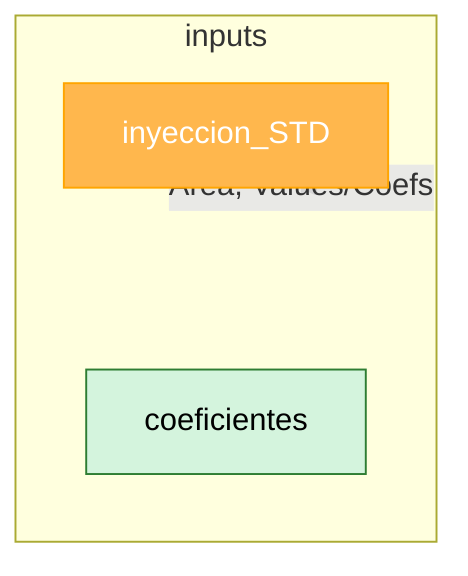

# Data Dictionary — [Nombre del modelo]

> Este documento es la fuente de verdad para trazar cada dato desde el
> Excel original hasta su representación en Python. Actualizar cada vez
> que cambie un input o se agregue una columna calculada.

## Sheet: `[Nombre_Sheet_1]` → DataFrame `df_[nombre]`

**Rango original en Excel:** `[ej: B3:H120]`
**Frecuencia de actualización:** [manual / diaria / por batch]
**Cargado por:** `src/io/load_[nombre].py`

| Columna Python | Nombre en Excel | Tipo | Unidad | Rango válido | Origen | Notas |
|---|---|---|---|---|---|---|
| `presion_kpa` | Presión (kPa) | float | kPa | 0–10000 | Input manual / sensor | Convertida desde kg/cm² del excel original |
| `caudal_m3d` | Caudal | float | m³/día | ≥0 | Fórmula `=Sheet2!C4*24` | Ver `docs/decisions.md #3` |
| `locacion` | Locación | str | — | catálogo cerrado (ver abajo) | Input manual | Normalizado con `.str.strip().str.upper()` |

**Catálogo `locacion`:** `[LOC_A, LOC_B, ...]`

---

## Sheet: `[Nombre_Sheet_2]` → DataFrame `df_[nombre]`

| Columna Python | Nombre en Excel | Tipo | Unidad | Rango válido | Origen | Notas |
|---|---|---|---|---|---|---|
| | | | | | | |

---

## Columnas calculadas (no vienen de ningún sheet)

| Columna Python | Fórmula / lógica | Reemplaza a (celda/rango Excel) | Notas |
|---|---|---|---|
| `poder_calorifico` | `f(composicion, presion, temp)` según norma [GPA 2172 / etc] | `Sheet3!F2:F120` | Ver docstring en `src/model/gas_props.py` |

---

## Supuestos y discrepancias conocidas Excel vs Python
- [ ] Ej: "El excel redondeaba a 2 decimales en pasos intermedios, Python
  usa precisión completa — puede generar diffs de <0.1% en el resultado final."

inyeccion_std = pd.concat([inyeccion_9300.iloc[:, :2],  inyeccion_9300.iloc[:, 2:]/coeficientes.iloc[:, 1:]], axis = 1)

### INPUTS

